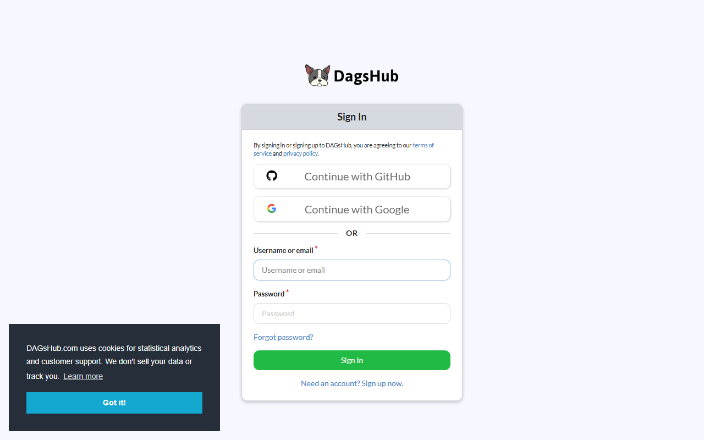
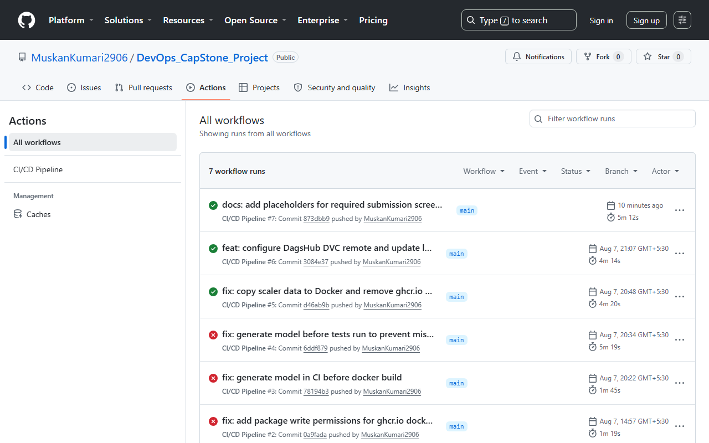
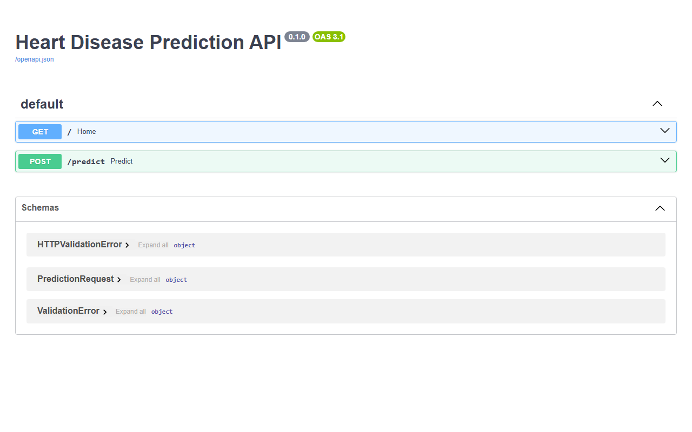

# End-to-End MLOps Project

This project demonstrates a complete MLOps pipeline for Heart Disease prediction.

## Features
- **Data Versioning**: DVC
- **Experiment Tracking**: MLflow
- **Model Training**: Random Forest, Logistic Regression, XGBoost
- **API Deployment**: FastAPI
- **Containerization**: Docker
- **CI/CD**: GitHub Actions

## Setup Instructions
1. Install dependencies: `pip install -r requirements.txt`
2. Run data pipeline and training: `dvc repro`
3. View MLflow UI: `mlflow ui`
4. Run FastAPI server: `uvicorn src.serve:app --reload`
5. Run tests: `python -m pytest tests/`

## Docker
Build image: `docker build -t devops_project .`
Run container: `docker run -p 8000:8000 devops_project`

## Project Screenshots

### 1. MLflow Experiments Tracking
*(Shows multiple experiments and models logged)*

### 2. Registered Model Artifacts
*(Shows the successful model registry and artifact logging)*

### 3. DVC Data Versioning
*(Demonstrates that the dataset and models are tracked by DVC)*

### 4. CI/CD GitHub Actions Pipeline
*(Shows successful automated test and docker build)*

### 5. FastAPI Prediction Endpoint
*(Testing the POST /predict endpoint)*

